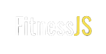
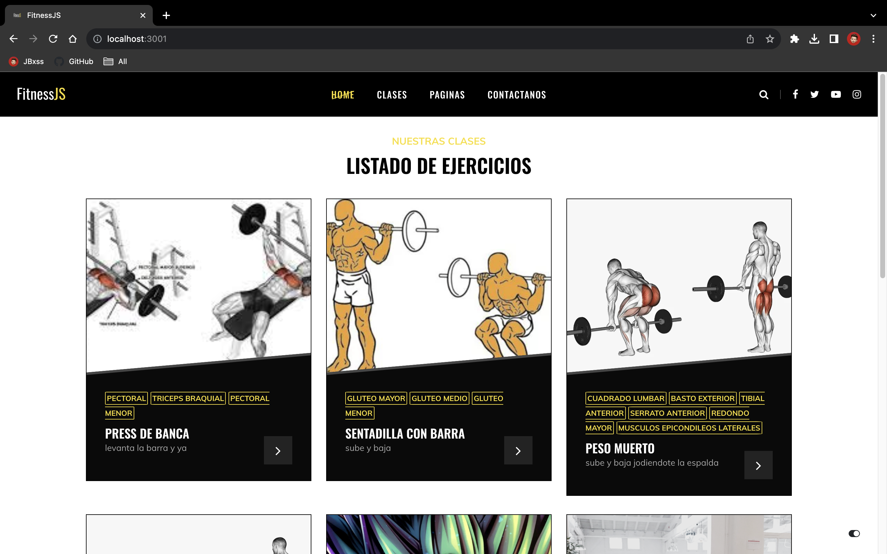
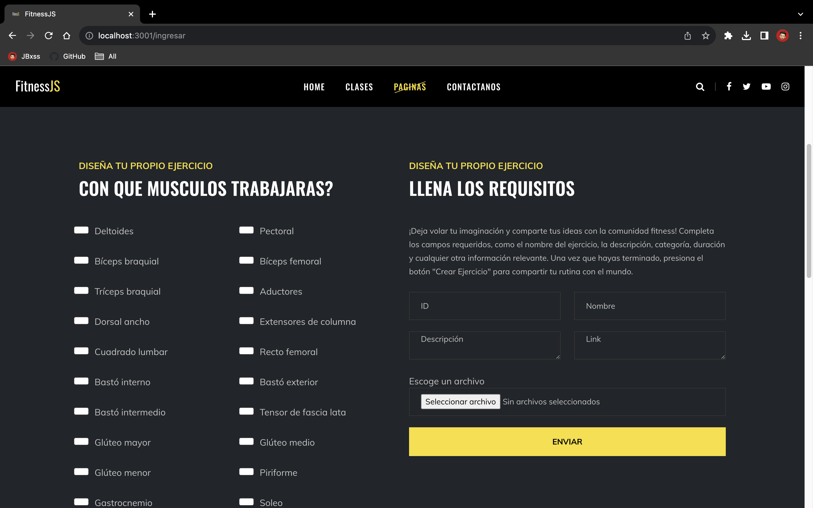

# FitnessJS - Plataforma de Ejercicios



FitnessJS es una plataforma web desarrollada con EJS y NodeJS que te permite acceder a una lista de ejercicios y crear nuevos ejercicios a través de un formulario fácil de usar. Ya sea que seas un entusiasta del fitness, un atleta o simplemente alguien que busca mantenerse en forma, FitnessJS tiene todo lo que necesitas para llevar un seguimiento de tu rutina de ejercicios.

## Características

- **Lista de Ejercicios:** Explora una amplia variedad de ejercicios disponibles en la plataforma. Encuentra ejercicios para diferentes grupos musculares y niveles de dificultad.

- **Creación de Ejercicios:** ¿No encuentras un ejercicio en nuestra lista? ¡No hay problema! Con el formulario de creación de ejercicios, puedes agregar tus propias rutinas y compartirlas con la comunidad.

- **Diseño Responsivo:** FitnessJS está diseñado para funcionar perfectamente en diferentes dispositivos, desde computadoras de escritorio hasta tablets y teléfonos móviles.

## Capturas de Pantalla


_Ejemplo de la lista de ejercicios disponibles._


_Formulario de creación de ejercicios._

## Cómo Usar

1. Clona este repositorio en tu máquina local.

   ```bash
   git clone https://github.com/Andestid/fitnes-js.git
   ```

2. Instala las dependencias utilizando npm.

   ```bash
   cd FitnessJS
   npm install
   ```

3. Ejecuta la aplicación.

   ```bash
   npm start
   ```

4. Abre tu navegador web y accede a `http://localhost:3001` para empezar a utilizar FitnessJS.

## Contribución

¡Tu contribución es bienvenida! Si deseas mejorar FitnessJS, sigue estos pasos:

1. Haz un fork de este repositorio.

2. Crea una rama para tu función o corrección.

   ```bash
   git checkout -b nueva-funcion
   ```

3. Realiza tus cambios y commits.

   ```bash
   git commit -m "Añadida la función de..."
   ```

4. Envía tus cambios al repositorio remoto.

   ```bash
   git push origin nueva-funcion
   ```

5. Abre una Pull Request en GitHub.

## Tecnologías Utilizadas

- EJS
- NodeJS
- Express

## Créditos

- Desarrollado por [Andrew Mendoza](https://github.com/Andestid)
- Diseño de la interfaz y concepto por [Juan Bossa](https://github.com/JBxss)

## Licencia

Este proyecto está bajo la Licencia MIT. Consulta el archivo [LICENSE](LICENSE) para más detalles.

---

¡Esperamos que disfrutes usando FitnessJS para mejorar tu rutina de ejercicios y mantenerte en forma! Si tienes alguna pregunta o sugerencia, no dudes en abrir un issue en este repositorio. ¡Mantente activo y saludable! 💪🏋️‍♀️